# Sales Analysis of Olist E-commerce Store
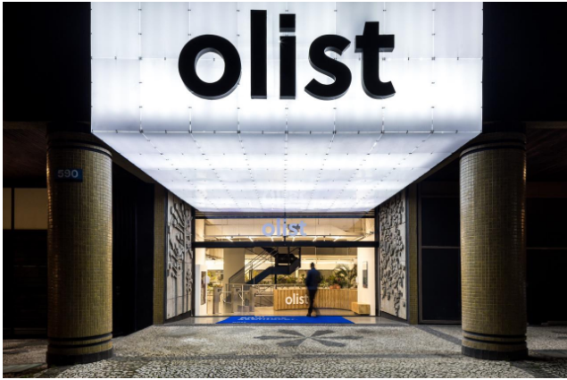

[Image Credit](https://techcrunch.com/wp-content/uploads/2021/04/Olist-HQ-in-Brazil-1.jpg?w=1390&crop=1)

## Introduction
This is an Exploratory Data Analysis (EDA) and visualization project about a Brazilian e-commerce platform known as **Olist**, which connects merchants to customers interested in purchase of their products and/or services.  The dataset was made available to the public to enable Data Analysts gain better understanding of the e-commerce landscape in Brazil and identify opportunities for growth and optimization. This project was done during a data analysis challenge hosted online by @DataChallengeSpace where each person carries out the project with any tool of choice.  I chose to carry out the project using Power BI to hone my DAX & Data modelling skills among others, while providing insights that identifies opportunities for growth and optimization for the **Olist** e-commerce platform.

## Power BI Skills/Concepts applied:
- Data Cleaning/Validation in Power Query
- Data Modelling
- Data Visualization
- DAX Concepts: Calculated Measures, Calculated Columns.
- Filters and slicers
- Drill-through

## About the Data
The raw data was gotten from **[Kaggle]( https://www.kaggle.com/datasets/olistbr/brazilian-ecommerce)**. It contains **9 tables** which are `Olist_customers`, `Olist_geolocation`, `Olist_order_items`, `Olist_order_payments`, `Olist_order_reviews`, `Olist_orders`, `Olist_products`, `Olist_sellers`, `Product_category_name`. These tables contain a wide range of information about each order, including the order date, product details, payment and shipping information, customer and seller IDs, customer reviews, sellers who list their products on Olist, as well as data on customer behaviour and demographics. You can check out the **[data dictionary]( https://github.com/Analyst-Joan/Olist_Store_Exploratory_Data_Analysis/blob/main/Olist_Data_Dictionary.pdf)** for description of the tables' contents.

## Business Question
 The following business questions have been presented to enable the Olist team gain better insights into their e-commerce platform and optimize available opportunities for growth. My goal is to present answers to these questions and deliver valuable insights that will evoke business growth for the Olist e-Commerce platform.


1.	What is the total revenue generated by Olist, and how has it changed over time?
2.	How many orders were placed on Olist, and how does this vary by month or season?
3.	What are the most popular product categories on Olist, and how do their sales volumes
compare to each other?
4.	What is the average order value (AOV) on Olist, and how does this vary by product category or payment method?
5.	How many sellers are active on Olist, and how does this number change over time?
6.	What is the distribution of seller ratings on Olist, and how does this impact sales
performance?
7.	How many customers have made repeat purchases on Olist, and what percentage of total sales do they account for?
8.	What is the average customer rating for products sold on Olist, and how does this impact
sales performance?
9.	What is the average order cancellation rate on Olist, and how does this impact seller
performance?
10.	What are the top-selling products on Olist, and how have their sales trends changed over time?
11.	Which payment methods are most commonly used by Olist customers, and how does this vary by product category or geographic region?
12.	How do customer reviews and ratings affect sales and product performance on Olist?
13.	Which product categories have the highest profit margins on Olist, and how can the
company increase profitability across different categories?
14.	How does Olist's marketing spend and channel mix impact sales and customer acquisition costs, and how can the company optimize its marketing strategy to increase ROI?
15.	Geolocation having high customer density. Calculate customer retention rate according to geolocations.


## Data Transformation in Power Query
The dataset was extracted and imported into Power BI’s Power Query for data validation and cleaning.  To begin the data cleaning process, the column profiling was first changed from ‘based on Top 1000 rows’ to ‘based on entire dataset’. **‘Column quality’**, **‘Column profile’** and **‘Column distribution’** checkboxes were then selected to get a summary information about each column in each of the tables for effective validation and transformation where needed. The dataset was cleaned per table. Below is the outlined summary of the transformation process that was carried out:

- The "Use First row as header" action was applied to columns where first rows were not headers.
- Column datatypes were validated appropriately.
- Columns that contain currency data such as Price, payment value, etc. were changed to "Fixed decimal" number for consistency.
- Text columns were formatted to be in Proper case were applicable.
- Special characters were standardized accordingly e.g. _"são paulo"_ was replaced with _"sao paulo"_.
- Abbreviated names were replaced with their respective full names for clarity.
- The columns with date and time together were split to extract date part and for ease of date-based analysis.
- `Product_category_name` table was merged with `Olist_products` table.
- Duplicates were removed where applicable.
- Redundant/irrelevant columns were removed where applicable.

_The dataset had 8 tables after validation and cleaning._ Details of cleaning per table can be found **[here]( https://github.com/Analyst-Joan/Olist_Store_Exploratory_Data_Analysis/blob/main/Data_Cleaning_Steps_in_Power_Query.pdf)**. Below are snapshots of the transformed tables.

| Olist_order_items                   | Olist_orders                        |
| ----------------------------------- | ----------------------------------- |
| 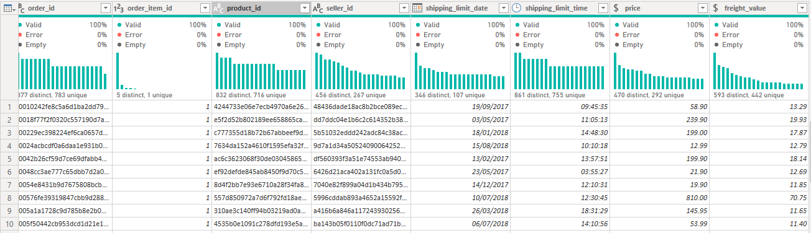          | 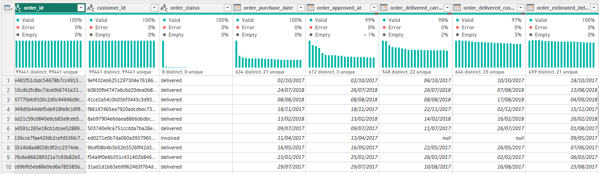               |

| Olist_customers                     | Olist_Sellers                       |
| ----------------------------------- | ----------------------------------- |
| 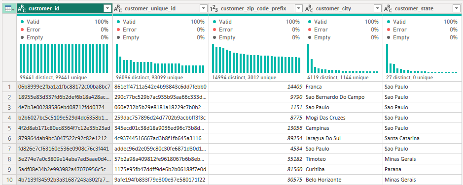             | 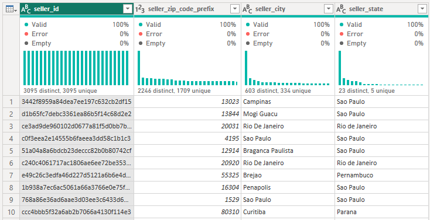              |

|  Olist_products                     |  Olist_order_payments               |
| ----------------------------------- | ----------------------------------- |
| 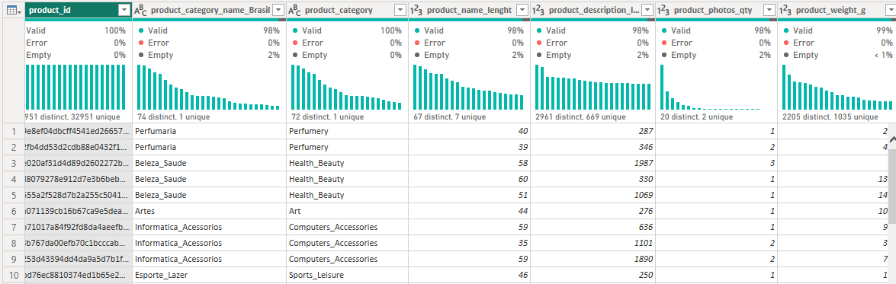             | 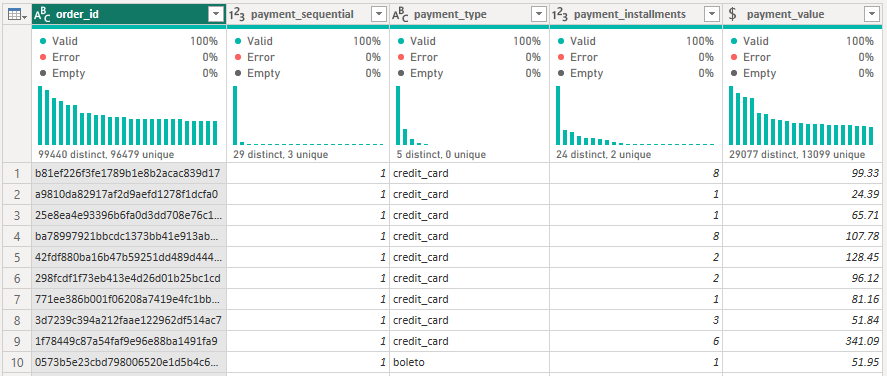 |

| Olist_geolocation                   | Olist_Order_reviews                 |
| ----------------------------------- | ----------------------------------- |
| 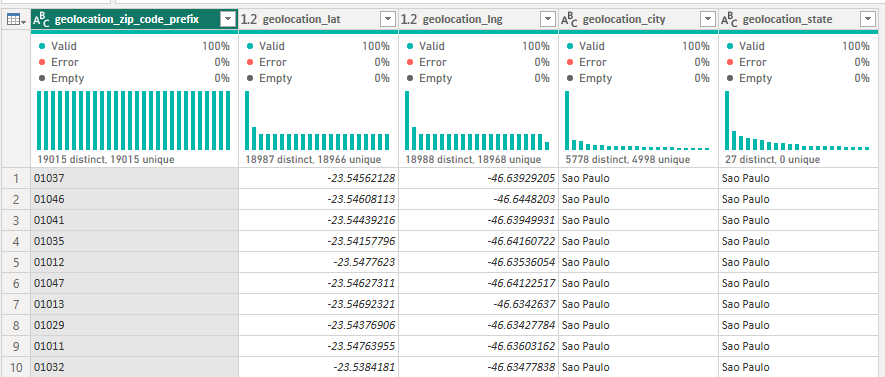          | 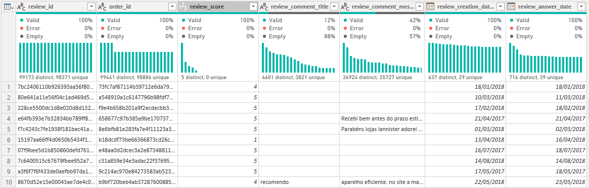        |


## Data Modelling
The data to be used for the analysis is [Normalised](https://www.kaggle.com/datasets/olistbr/brazilian-ecommerce), that is, located in various tables, and thus requires appropriate modelling. The Model from the cleaned data is a **Star Schema** comprising of:
**_One Fact table:_** `Olist_Order_items`, which contains the lowest level of granularity, including quantitative and numeric measures associated with the e-commerce platform which can be aggregated during Analysis.

**_One Factless fact table:_** `Olist_Orders`, which contains dates to track sales/purchase events and foreign keys that only reference a dimension but do not have any associated measures that can be aggregated neither is it descriptive. It serves more like a bridge table between the dimensions to establish relationships.

**_Six dimension tables:_** `Olist_customers`, `Olist_geolocation`, `Olist_order_payments`, `Olist_order_reviews`, `Olist_products`, `Olist_sellers` . These contains attributes that describe the data on the fact tables and are to be used to constrain/filter queries on the fact tables (i.e. to limit inquiries to the primary data)

A date dimension table `**"DimDate"**` was then created in power query using M Query language gotten from **[online research](https://devinknightsql.com/2015/06/16/creating-a-date-dimension-with-power-query/)**, which I adjusted to include Fiscal year, Fiscal Month and fiscal Quarter. 

| Date_Table                          |                                     |
| ----------------------------------- | ----------------------------------- |
| 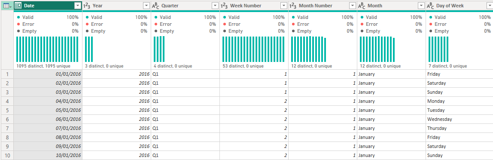                   | 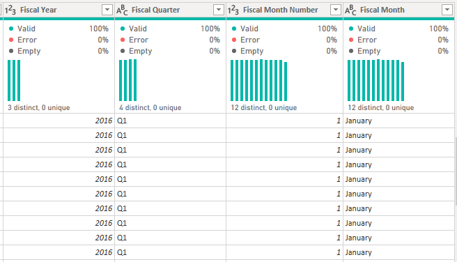                   |

This was created to have a comprehensive view of the date data, enable flexibility of time-based analysis, and creating hierarchical relationship at different levels of granularity (such as day, week, month, etc.), which facilitates drill-down capabilities in visualization.

The 7 dimension tables were then modelled/connected to the fact tables using Primary and foreign keys, that is, the common columns between them.

`Olist_order_items` table was modelled with:
- olist_orders table using "order_id"
- olist_sellers table using "seller_id"
- olist_product table using "product_id"

`Olist_orders` table was connected to:
- olist_customers table using "customer_id"
- olist_order_payment table using "order_id"
- olist_order_reviews table using "order_id"
- DimDate table Using "Date/ order_purchase_date"

_(Olist_geolocation Table was connected to the olist_customers table via the Zip_code_prefix)_

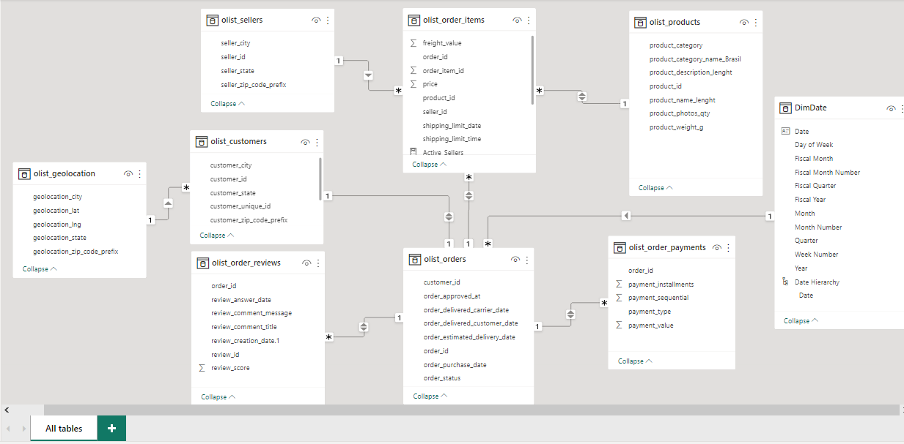

 The relationships between the tables are mainly one-to-many/many-to-one, except for the one between the customer and order table, which is a one-to-one relationship.

## Data Exploration and Visualization in Power BI
This was done using DAX Concepts (Calculated Measures, Calculated Columns, etc.), Visuals/Charts, Drill-throughs, Filters and slicers, etc. in Power BI.
### 1: What is the total revenue generated by Olist, and how has it changed over time?
The total revenue generated by Olist E-commerce Store between September 2016 & September 2018 is **R$15,422,461.77 (15.42million Brazilian real)**. This was gotten by calculating the sum of the Payment_value for orders that are delivered using the DAX calculated measure shown below:
```
Total Revenue = 
CALCULATE(
    SUM(olist_order_payments[payment_value]),
      olist_orders[order_status] = "delivered"
)
```
Orders with status as "delivered" were used to determine the total revenue as only delivered orders contributes to the actual/assured revenue generated.
Exploring the revenue generation over time, we see from our visual below, that there has been a continuous increase in revenue over the 3-year period in review, with the highest increase occurring between 2016 and 2017.

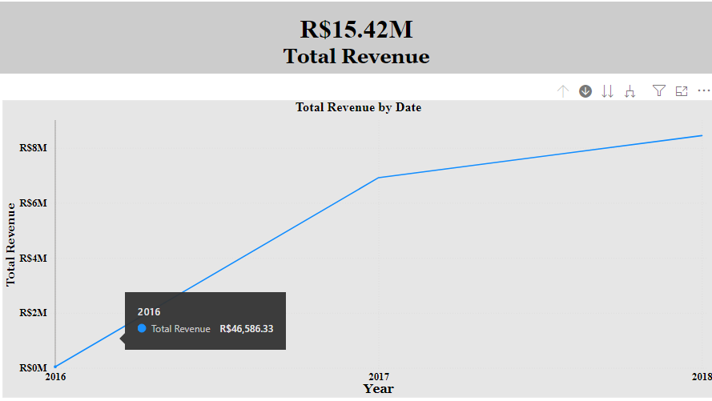

Drilling down to the Months, the trend of revenue increase over time is still observed, but with a sharp dip in the month of September. Hmmm! 🤔 what would have been the cause of this dip? To, check this, I drilled down further to dates and observed that most of the sales record available occurred from 3rd October 2016 to 29th August 2018, hence the September record is mostly for one year -2017. Also, the analysis at the date level, also presented a sharp increase in revenue on **24th November 2017**, which I discovered was a **Black Friday** - _A day that is characterized by sales of products at highly discounted rates._ This may have encouraged the large purchases made by customers on the store on that day.

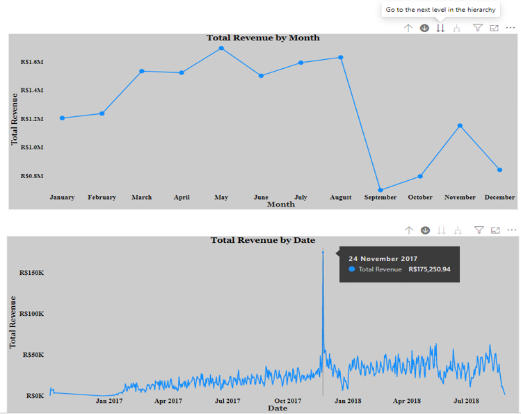

Let’s now evaluate the orders placed, perhaps a similar trend occurred on Black Friday.


### 2: How many orders were placed on Olist, and how does this vary by month or season?
A total of **99,441 orders** were placed on the Olist e-commerce store, of which **_96,478_** were delivered, and thus contributed to the revenue.

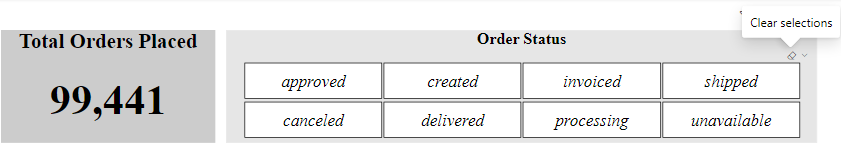

Looking through the months and years, I observed a trend of increase in orders over time as was seen in the evaluation of the Total revenue over time. The highest number of successful orders (7289) was placed in November 2017. This would be as a result of the **Black Friday Effect** on 24th November 2017.

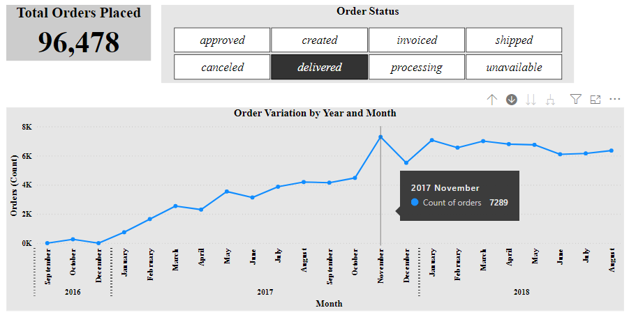

### 3: What are the most popular product categories on Olist, and how do their sales volumes
compare to each other?
Having observed the trend in customer orders and revenue generated, it is important to consider the products advertised on the Olist platform for sale – Which of these product categories are popular? Does popularity affect their sales volume?
In terms of popularity, the most popular product category is the **Bed_Bath_Table** having 9,417 orders, with the next two in the top 3 popular product categories being **Health_Beauty (8,836 orders)** and **Sports_Leisure (7,720 orders)**. 

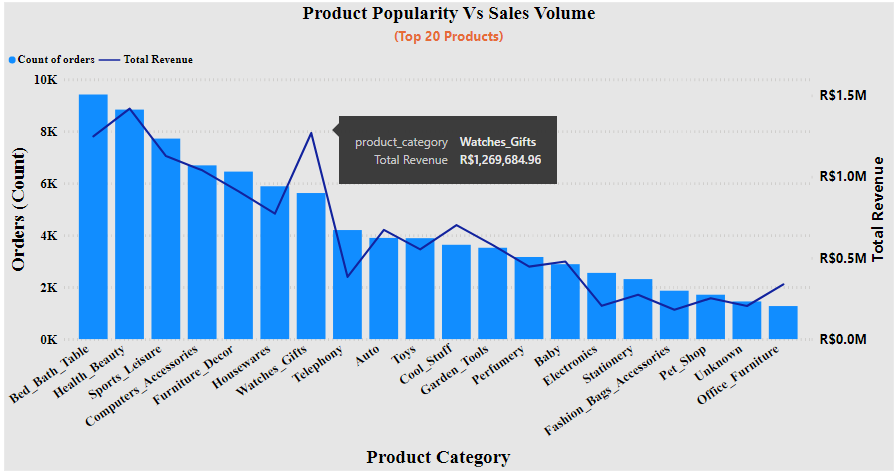

However, in terms of sales volume, the **Health_Beauty** product category has the highest sales volume of R$1,419,509.89, followed by Watches_Gifts category (R$1,269,684.96) and Bed_Bath_Table (R$1,249,411.56) being the 3rd in highest sales volume.

### 4: What is the average order value (AOV) on Olist, and how does this vary by product category or payment method?
From the preceding visual, we see that the most popular product did not have the highest sales volume, hence, we probe further to evaluate the average monetary value of each order placed by the Olist customers, that is, the Average order value (AOV) and their variation across the product categories & payment methods used by the customers.

The average order value on the Olist store is **R$159.85**. This was gotten by dividing the Total revenue by total number of orders that are delivered using the DAX calculated measure below:
```
Average Order Value = 
                  DIVIDE ([Total Revenue], 
                      CALCULATE(COUNTROWS('olist_orders'), 
                         olist_orders[order_status] IN {"Delivered"})
)
```


Exploring the AOV across the product categories and payment types, we see that the product category with the highest average order value is **Computers**, while **Credit card** is the payment type that has the highest Average order value.

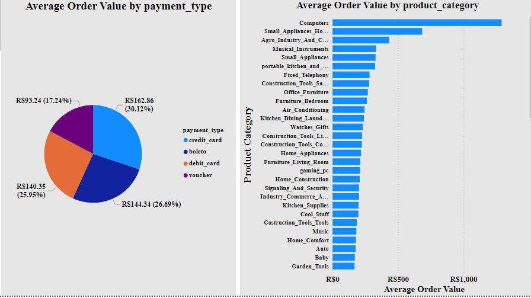


### 5: How many sellers are active on Olist, and how does this number change over time?
As a platform that connects merchants to customers, it is important to know how many of the merchants / sellers on the platform have been active over time. The metric I used is, _A seller is said to be active if s/he has made at least a successful sale within a 30-day period_. A successful sale is taken to be orders that have been delivered to the customer. The measure below was used to compute the Active sellers.
```
Active_Sellers = CALCULATE(
                     DISTINCTCOUNT('olist_order_items'[seller_id]),
                      	 'olist_orders'[order_status] = "delivered",
                          		'olist_orders'[order_purchase_date] >= MIN('olist_orders'[order_purchase_date]) - 30,
   	                          	'olist_orders'[order_purchase_date] <= MAX('olist_orders'[order_purchase_date])
                   )
```
This measure counts the distinct number of seller IDs in the 'olist_orders_items' table where the order status is "delivered" and the order purchase date falls within the last 30 days from the maximum order purchase date. This gives the number of active sellers as **2,970**.


Going further, I evaluated the variation of Active sellers on the platform over time and observed that there has been a consistent increase in active sellers across the years and months. 

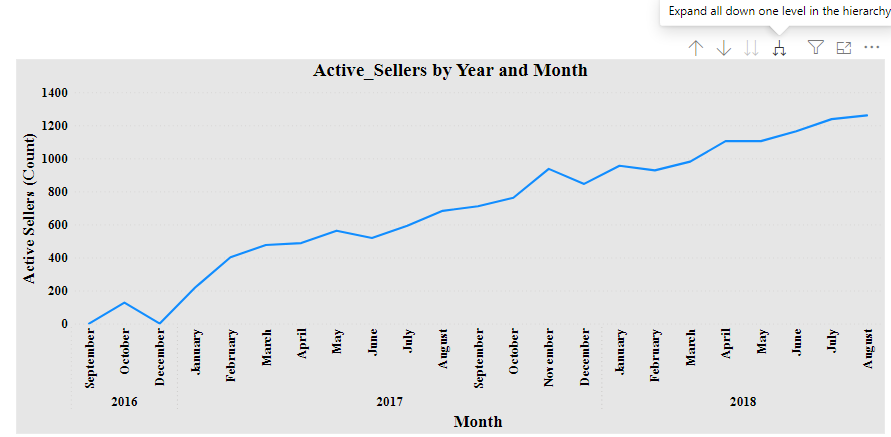


### 6: What is the distribution of seller ratings on Olist, and how does this impact sales performance?
Now we know how many of the Olist sellers are active, we will now evaluate how customers rate them and the impact on their performance. To do this, I created a calculated measure to get the Average customer rating from the review scores. The DAX measure is shown below:
```
Average Rating = AVERAGE('olist_order_reviews'[review_score])
```
The sales performance was then evaluated using the total revenue per seller and average rating. The resulting visual shows that Sellers with high ratings tend to have higher sales outcome than those with lower ratings, with the highest performing seller having an average rating of 4.12.

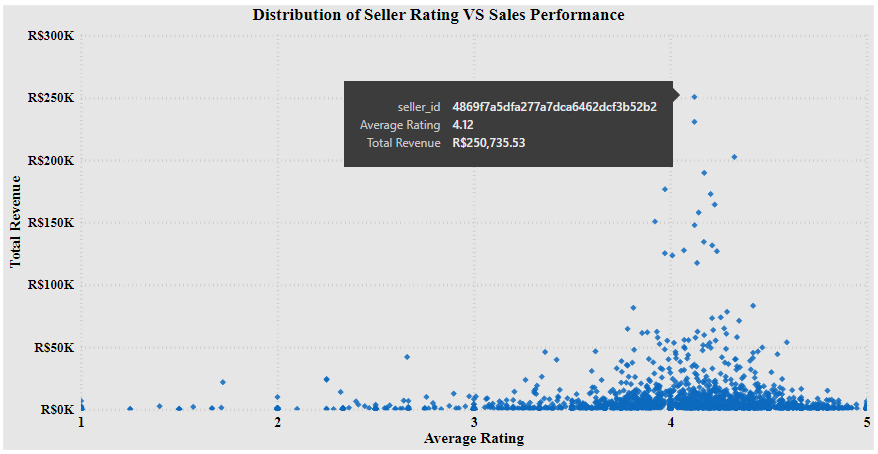


### 7: How many customers have made repeat purchases on Olist, and what percentage of total sales do they account for?
Based on the previous visual, we observed that more than 50% sellers were rated fairly high. We now want to see if the seeming satisfaction led to repeat purchases by the customers. To determine this, I created a calculated column to filter out orders that are repeat purchases based on the customers’ unique id. The DAX formula below was used to create the column:
```
Repeat_Purchases = CALCULATE(
                      IF(COUNT('olist_orders'[order_id])>1,1,0),
                          ALLEXCEPT(olist_customers,olist_customers[customer_unique_id]))
```
The formula calculates whether a customer has made more than one purchase or not by checking if the count of 'order_id' in the `olist_orders` table is greater than 1. If it is, it returns 1, indicating that the customer has made repeat purchases. Otherwise, it returns 0, indicating that the customer has made only one purchase. Afterwards I created a calculated measure to get the total count of customers that had repeat purchases i.e. customers whose count of 'order_id' in the `olist_orders` table returned 1. The DAX measure is shown below:
```
Repeat Purchase Customers = CALCULATE( 
                                DISTINCTCOUNT(olist_customers[customer_unique_id]),
                                   olist_customers[Repeat_Purchases] = 1,
                                       olist_orders[order_status] = "Delivered")
 ```

The measure calculates the distinct count of customers who have made repeat purchases and have their order status as ‘delivered’. Delivered orders alone were taken into account, as they represent true repeat purchases. Our computation output shows that 2,979 customers made repeat purchases.


Let’s now find out the impact of this repeat purchases on the Total revenue. 

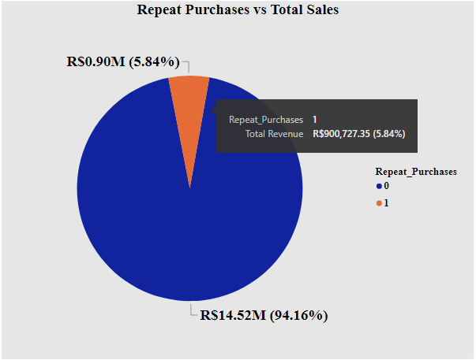

Based on the visual above we can see that repeat purchases accounted for 5.84% (R$900,727.35) of the total revenue.


### 8: What is the average customer rating for products sold on Olist, and how does this impact sales performance?
From the exploration so far, we see that less than 5% of the customers made repeat purchase. To ascertain the possible cause of this behaviour, let’s evaluate the impact of customer ratings for the products on the sales performance. Average rating was computed to be **4.07**, which is a good rating on a scale of 1 to 5. 


How does this impact the sales performance?

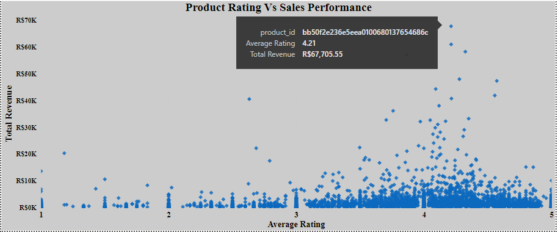

Based on the resulting visual shown above, the product with the highest sales amount has a rating of 4.21, which is above the overall average rating.

### 9: What is the average order cancellation rate on Olist, and how does this impact seller performance?
As we continue to evaluate Olist customers’ behaviour, from repeat purchases to ratings for sellers/products, we will now look into cancelled orders, to understand its effect on the performance of sellers/merchants on the Olist platform. It will also be important to know factors that can influence these order cancellations and seller performance. To explore this stage, I computed the average order cancellation rate using the measure below and its result gave **0.63%**.
```
Average Order Cancellation Rate = 
                                 DIVIDE(
                                    CALCULATE(COUNTROWS(olist_orders),
    	                                  olist_orders[order_status] = "canceled"),
                                          COUNTROWS(olist_orders))
```


I then evaluated average order cancellation rate for the sellers based on Minimum price of product, Total revenue, average rating, and number of orders. I leveraged AI feature of Power BI for this by using the _Key Influencers_ visual. Based on the visual below, we can opine that as average rating decreases, average order cancellation rate increases and vice versa. Similarly, as minimum price of a seller decreases, it becomes probable that the average order cancellation rate will decrease and vice versa.

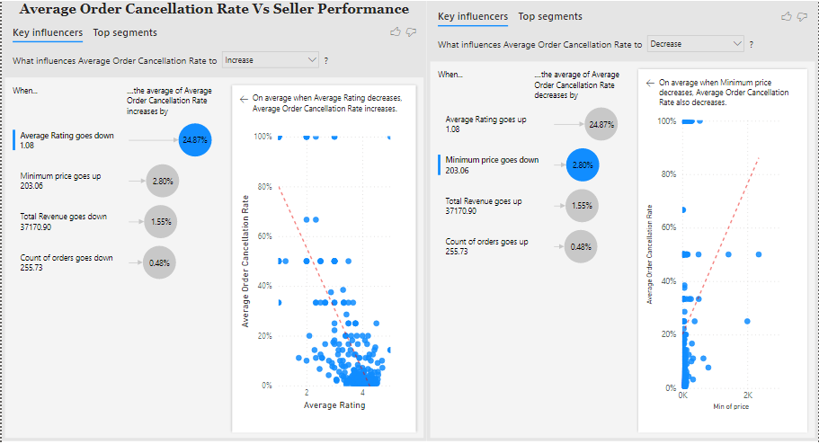

Furthermore, an increase in average order cancellation rate, results in decrease in number of orders sold and Total revenue,  while a decrease in average order cancellation rate, gives rise to an increase in number of orders sold and Total revenue.

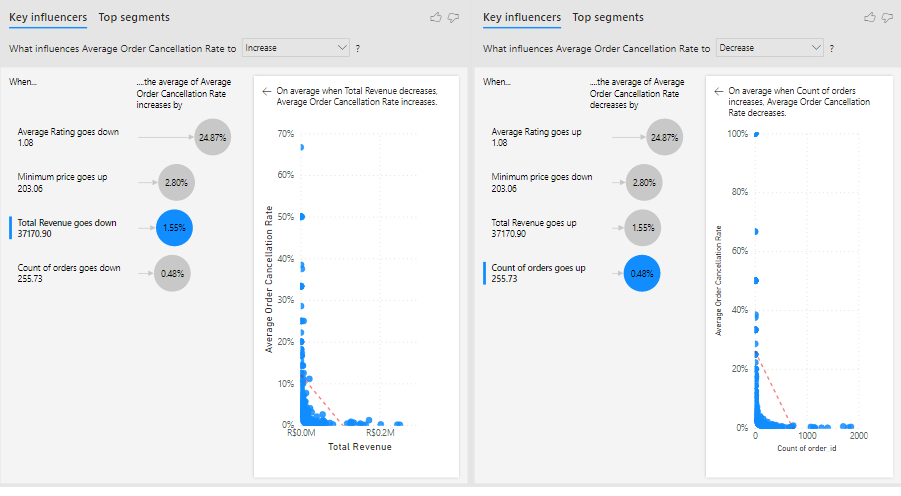

There is therefore need to mitigate the factors that may likely increase average order cancellation rate.

### 10: What are the top-selling products on Olist, and how have their sales trends changed over time?
Having understood some aspect of Olist customers’ behaviour, let’s explore the products that are advertised on the platform for sale. I’ll be looking at the top 10 selling products and their sales trend over time. Using the decomposition tree visual below, I checked the product categories over the years in terms of their sales (total revenue).

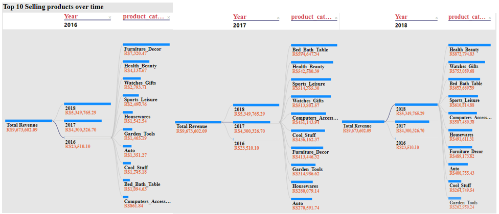

From the visual above, we can see that across the years, no product category remained the topmost selling product – In 2016, it was Furniture_Decor, in 2017 – Bed_Bath_Table took the lead, and in 2018, Health_Beauty became the topmost category. However, we also observed that the Health_Beauty category was constantly among the top 3 selling product categories across the 3year period in view.

### 11: Which payment methods are most commonly used by Olist customers, and how does this vary by product category or geographic region?
We will now move on to evaluate how customers make payments for the purchased products.

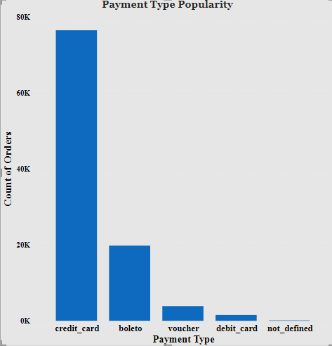

From the visual above we see that most common payment method is the **Use of Credit card** and the least method is the use of debit card. 
Exploring further across the locations and products in the visual below, we see the same pattern of the most used payment method being Credit card, followed by Boleto. However, we also observed that both Credit card and Boleto were used within all the 72 product categories.

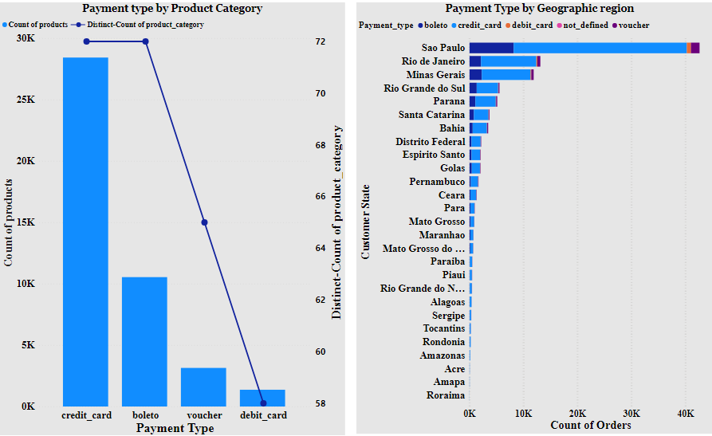


### 12: How do customer reviews and ratings affect sales and product performance on Olist?
Based on response to similar questions, Q6 and Q8, we have seen that sellers and products with the highest revenue/sales performance have ratings above average (4.07).

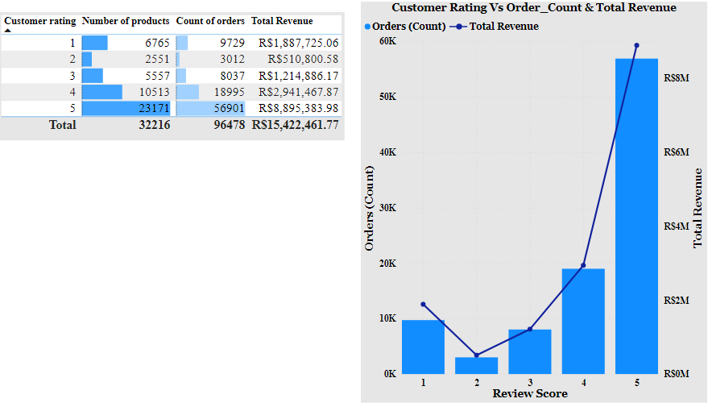

Exploring further, we observe from the visual above, that products with average review score of “2.0” had lesser revenue than products with average review score of “1.0”. This can be due to the quantity of the products sold that fell within the 1.0 rating, which is about 3 times that of the ones within the 2.0 rating. Hence, we can say that as rating/review score increases, the total revenue increases. 

### 13: Which product categories have the highest profit margins on Olist, and how can the company increase profitability across different categories?
Olist is not a non-profit organisation, hence it is important to know products that are more profitable for the business. We get this by evaluating the profit margin on the platform across the categories. To calculate the profit margin, we need to get the net profit by subtracting the cost price from the selling price(price), divide by the total revenue and multiply by 100 (percent). The data available does not capture the cost price, hence we are only able to check for the gross profit margin. The DAX measure below was used to calculate the gross profit margin. 

```
Gross_Profit_Margin = DIVIDE(
                         CALCULATE(SUM('olist_order_items'[price]),
                            olist_orders[order_status]="delivered"),
                               [Total Revenue])
```
The resulting Gross Profit Margin computed is **85.73%**.


Exploring across the categories, we observe that the product category with the highest gross profit margin is **"Computers"** with 95.71%, followed by the “Small_Appliances_Home_Oven_And_Coffee" category (94.56%), and then “Portable_kitchen_and_food_preparators" category (93.04%). Visual is shown below. 

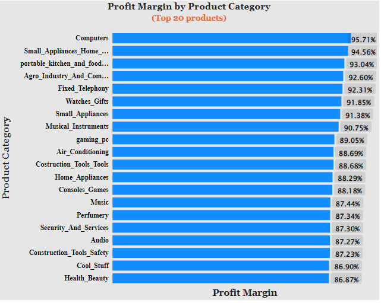

To increase profitability across different categories, Olist platform can Collaborate/Strengthen relationships with sellers and negotiate better terms such as bulk discounts, exclusive deals, etc.  They can also work with the sellers to improve their pricing strategy, ensuring that the pricing of their products are competitive, but not so low as to lose revenue. They may also consider using tiered pricing, where different prices are charged for the same product depending on the quantity or other factors.

Secondly, they can use strategies that encourage customers to purchase additional products or upgrade their purchases by implementing cross-selling and upselling techniques. To do this, they can leverage Artificial intelligence (AI) technology and data analytics to offer personalized recommendations on the platform based on customer preferences and buying patterns. This can increase the average order value and contribute to higher profitability. As we can see from our analysis that the category with the highest profit margin also had the highest Average order value.

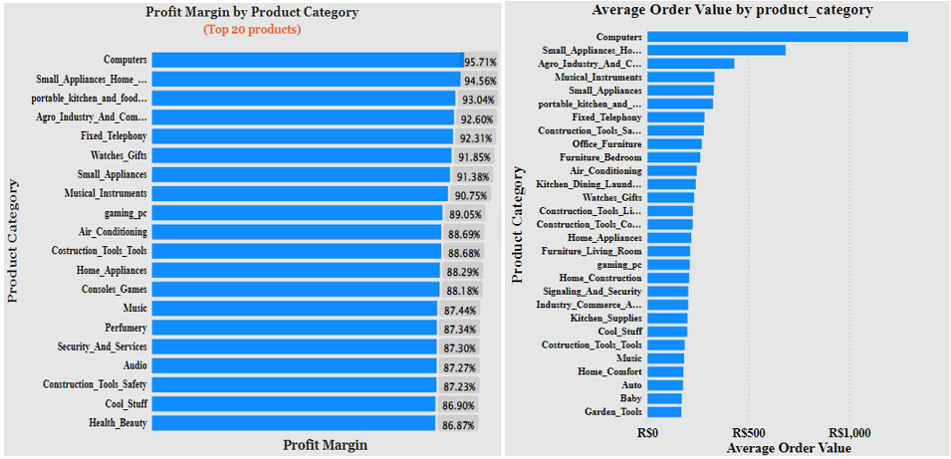

Additionally, they can consider phasing out or re-evaluating low-margin products that are not contributing significantly to profitability.

### 14: How does Olist's marketing spend and channel mix impact sales and customer acquisition costs, and how can the company optimize its marketing strategy to increase ROI?


**Marketing Spend** refers to _the amount of money allocated to marketing activities_, which directly influences the reach and impact of Olist's promotional efforts.

**Channel mix**, on the other hand, refers to _the distribution of marketing efforts across different mediums/channels such as social media, email marketing, Partnership with Influencers, etc._  The more diverse the channels mix, the more likely it will be to reach wider audience and potential leads that can be converted to customers. This will definitely have impact on the sales outcome.

Therefore, Increasing marketing spend by having sufficient allocation of funds to diverse channel mix can potentially increase brand visibility, encourage new customer acquisition, and ultimately drive sales. However, it is pertinent that the business prioritizes channels with high leads conversion rates, while striking a balance between the marketing budget and the return on investment (ROI) generated.

On **Customer Acquisition Costs (CAC)**, which is _the expenses incurred in acquiring a new customer,_ Olist can evaluate the cost-effectiveness of each acquisition channel by assessing the cost per lead, cost per customer, and customer lifetime value (CLTV) to determine the efficiency of marketing efforts. If the CAC is too high, adjustments can be made to optimize the strategy and reduce acquisition costs.


To optimize its marketing strategy and increase ROI, Olist can consider leveraging data analytics to gain insights into customer behavior, preferences, and purchasing patterns.  Such data-driven decision making will enable Olist to identify high-performing channels, adjust the channel mix where applicable, and optimize resource allocation.

Secondly, Olist can implement targeted marketing campaigns, where customer demographics, interests, and buying habits are analysed, and then, the messaging and promotional offers are tailored to meet specific customer segments. This can improve customer engagement, increase conversion of leads to Customer, and boost sales.


### 15: Geolocation having high customer density. Calculate customer retention rate according to geolocations
Finally, we will evaluate the spread of Olist customer base in terms of location. There were 99,441 customers for the 3-year period in review. In terms of high Customer density, the top three locations are **Sao Paulo, Rio de Janeiro, and Minas Gerais**

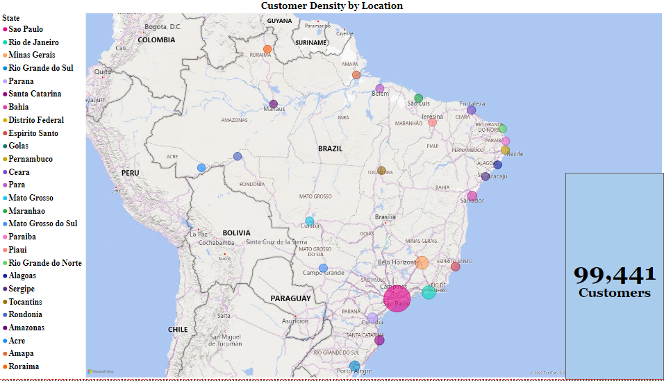

But does High Customer density equate high Customer retention rate? To check for this, the overall Customer retention rate was computed using the DAX measure below. The results was 3.0
```
Customer Retention Rate % = 
                          DIVIDE('olist_customers'[Repeat_purchase_customers],
                            COUNTROWS('olist_customers')) 
                              * 100
```
Exploring further, we see that in terms of customer retention, we have the location with the highest Customer retention rate to be **Acre**, despite being among the last 3 location with the least customer density. The next two high customer retention locations are **Rondonia and Mato Grosso**.

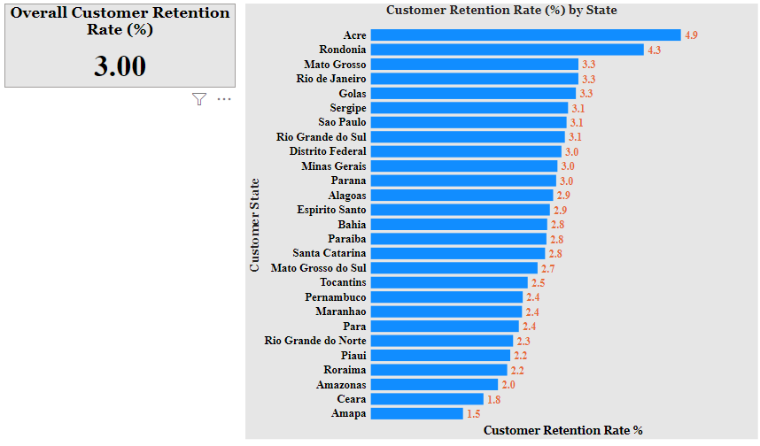

## Key Insights

- ‌Olist E-commerce Store generated a total revenue of 15.42 million Brazilian real(R$15,422,461.77) within the 3-year period in review. The high revenue may be attributed to presence of a wide range of product categories, competitive pricing, a user-friendly platform that attracts and retains customers, etc.

- In 2017, ‌16.66% of the total revenue was generated in November, with the Black Friday sales (R$175,250.94) accounting for 15.19% of the total revenue generated in November 2017 (R$1,153,528.05). The  popularity of the "Black Friday" sales in Brazil will have enhanced this outcome.

- ‌The platform recorded order delivery success rate of 97% for all placed orders.This is a pointer that Olist has a well-established logistics and Order fulfillment system in place, which ensures that customers receive their orders reliably and on time.

- ‌The products categories with the highest Quantity of orders didn't always generate higher sales volume. This may be due to the price and quality of the products. 

- ‌The Average order value (AOV) for the Olist platform is R$159.85 . This high AOV suggests that customers are buying more expensive products.

- The Platform has ‌96% active sellers, which suggests that Olist provides a favorable platform for merchants/sellers to conduct their business, resulting in a consistent increase in the number of active sellers over time.

- Customers that made repeat purchases generated ‌5.84% of the total revenue. The presence of repeat purchases indicates that Olist has a loyal customer base.

- ‌Credit Cards are the major type of payment used by Olist Customers, followed by Boletos while the least used method is Debit card. This may be due to credit cards being more widely accepted than debit cards. This preferrence may also be due to the convenience and security offered by credit card payments.

- ‌Products and Sellers with the highest sales performance had ratings that were above average(4.07). However, having the highest rating band of 5, didn't give rise to high sales performance for most products and sellers. This could be an indicator of Customer preferance for low priced goods.

- The Average Order Cancellation rate is 0.63% - which can be indicative of high Customer Satisfaction. However, the Olist e-commerce platform lost R$143,255.60 due to cancelled Orders. Customer ratings and minimum price of Sellers' products were found to be key influencers of the Average Order Cancellation rate, which in turn impacts the number of orders placed and revenue generated.

- ‌The product categories' sales trend are competitive as a new category always takes the lead as "Top selling product" each year.

- The Gross profit margin is 85.73%. The product category, Computers, which has the highest order value also generated the highest Gross profit margin. This is likely due to higher-priced products or better profit margins on items in the category.

- ‌Geolocation with the highest Customer density is Sao Paulo while the Geolocation with the highest Customer retention rate is Acre. However, the top 3 geolocations with high Customer densities also had retention rates above average(3.0). 

## Recommendations:

- Olist should implement a seasonal/quarterly promotional events like the "Black Friday" sales to drive customer engagement, high product purchase and increased revenue.

- They should strive to maintain high product quality and competitive pricing in order to minimize cancellations,  maximize customer satisfaction, and boost revenue.

-  Loyalty programs such as special discounts for repeat customers and free shipping to targeted locations like Sao Paulo and Acre can be implemented to drive increase in repeat purchases, increase in customer retention, and acquisition of new Customers.

- The high revenue & high profit margin suggests that the business has established a profitable online venture. They should consider investing in new products and services, expanding into new markets. This will drive new customer acquisition and ensure Olist stays ahead in the E-commerce business in Brazil.

## Conclusion

By responding to the business questions, I have achieved the goal of  helping Olist gain better insights into their e-commerce platform and know how to optimize available opportunities for growth.

 

Also, working on this dataset expounded my knowledge on e-commerce business metrics, and helped me improve my skills in Power BI DAX and Data modelling. I hope to build a dashboard from this report and provide an accessible link for interaction with the visuals soon.

Your candid comments, constructive criticisms and feedbacks are anticipated.


